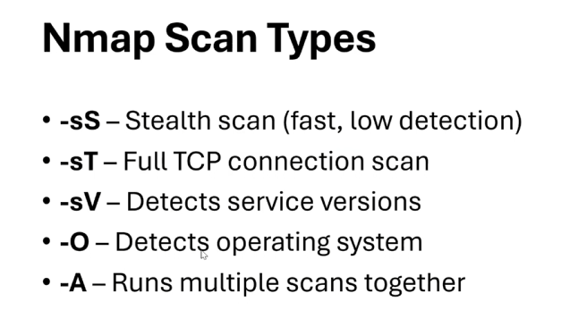
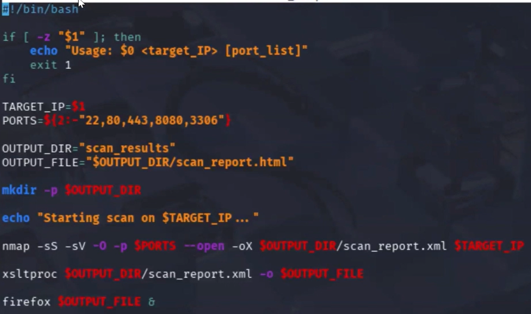
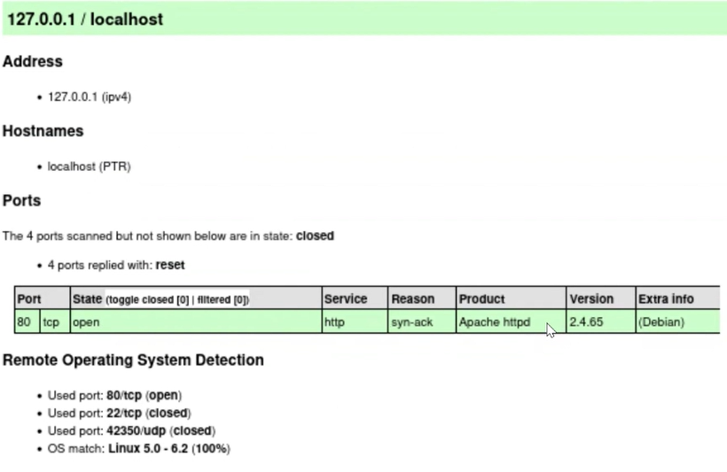

# Nmap Automation Reporting

## Screenshots

### Nmap Scan Types



This project uses several Nmap scan techniques including SYN scanning, service detection, operating system fingerprinting, and aggressive scanning to gather information about target systems.

### Bash Automation Script



The Bash script automates the scanning process by accepting a target IP address, executing Nmap scans, generating XML output, and converting results into an HTML report.

### HTML Scan Report



The generated HTML report provides a structured view of discovered hosts, open ports, running services, and operating system information.

## Project Overview

This project automates network reconnaissance using a Bash script and Nmap. Scan results are exported to XML and automatically converted into an HTML report using xsltproc, creating a readable format for security analysis and documentation.

## Tools Used

* Bash
* Linux
* Nmap
* xsltproc
* XML
* HTML

## What I Learned

This project helped me gain experience with:

* Linux command-line scripting
* Network reconnaissance
* Nmap scan types and options
* Service discovery
* Bash scripting and automation
* XML report generation
* HTML report creation
* Security assessment workflows

## Features

* Automated Nmap scanning
* Service version detection
* Operating system detection
* XML output generation
* HTML report generation
* Custom target support
* Custom port selection
* Organized scan results storage

## How To Run

Make the script executable:

```bash
chmod +x automated_nmap.sh
```

Run a scan:

```bash
./automated_nmap.sh 127.0.0.1
```

Run with custom ports:

```bash
./automated_nmap.sh 127.0.0.1 22,80,443
```

## Project Structure

```text
README.md
automated_nmap.sh
nmap_scan_types.png
bash_script.png
html_scan_report.png
scan_results/
```

## Future Improvements

* Timestamped report generation
* CSV export support
* Multiple target scanning
* Enhanced error handling
* Automated scan summaries

